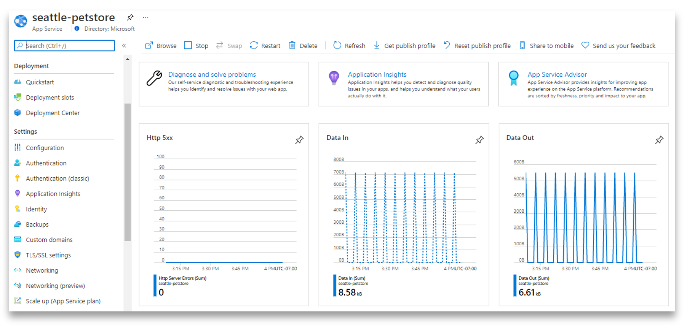
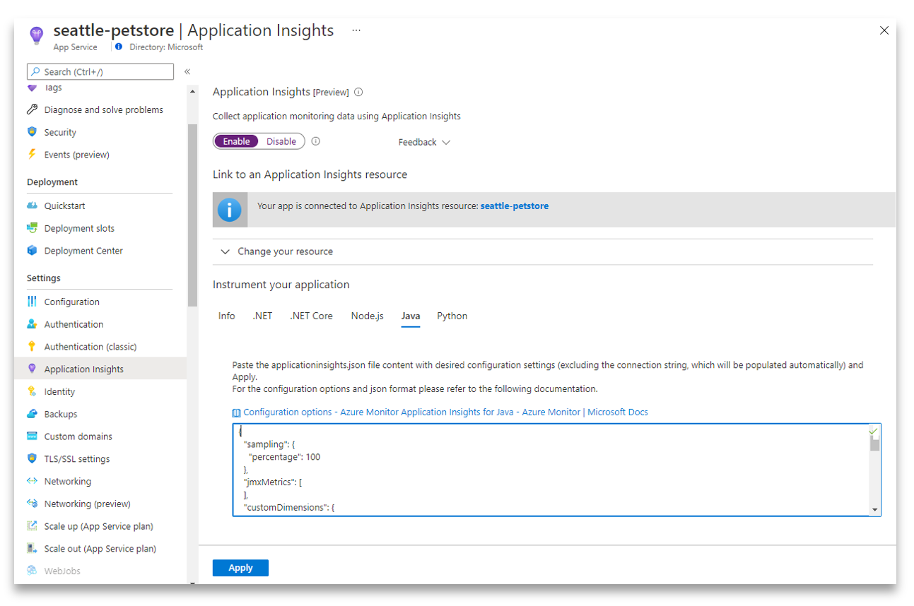
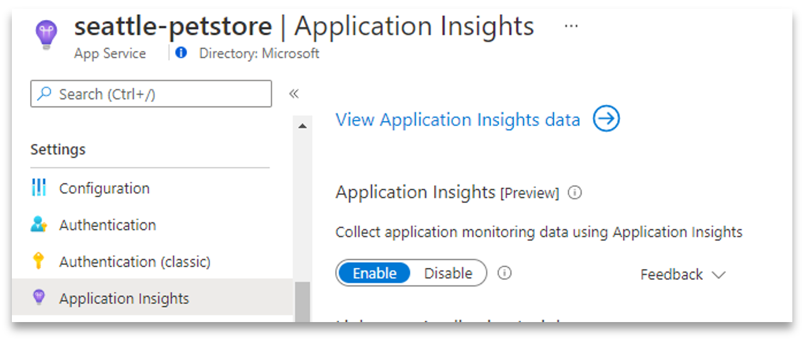

# 04 - Monitor Java EE application

__This guide is part of the [migrate Java EE app to Azure training](../README.md)__

Configure and monitor Java EE application and its dependencies using
Azure Monitor - Log Analytics and Application Insights.

---

## Create and configure Log Analytics Workspace

Create a Log Analytics Workspace using Azure CLI:

```bash
az monitor log-analytics workspace create \
    --workspace-name ${LOG_ANALYTICS} \
    --resource-group ${RESOURCE_GROUP} \
    --location ${REGION}                                       

export LOG_ANALYTICS_RESOURCE_ID=$(az monitor log-analytics workspace show \
    --resource-group ${RESOURCE_GROUP} \
    --workspace-name ${LOG_ANALYTICS} | jq -r '.id')
    
export WEBAPP_RESOURCE_ID=$(az webapp show --name ${WEBAPP} --resource-group ${RESOURCE_GROUP} | jq -r '.id')
```

Setup diagnostics and publish logs and metrics from Java EE application to Azure Monitor:
```bash
az monitor diagnostic-settings create --name "send-logs-and-metrics-to-log-analytics" \
    --resource ${WEBAPP_RESOURCE_ID} \
    --workspace ${LOG_ANALYTICS_RESOURCE_ID} \
    --logs '[
         {
           "category": "AppServiceHTTPLogs",
           "enabled": true,
           "retentionPolicy": {
             "enabled": false,
             "days": 0
           }
         },
         {
            "category": "AppServiceConsoleLogs",
            "enabled": true,
            "retentionPolicy": {
              "enabled": false,
              "days": 0
            }
          },
         {
            "category": "AppServiceAppLogs",
            "enabled": true,
            "retentionPolicy": {
              "enabled": false,
              "days": 0
            }
          },
         {
            "category": "AppServiceFileAuditLogs",
            "enabled": true,
            "retentionPolicy": {
              "enabled": false,
              "days": 0
            }
          },
          {
             "category": "AppServiceAuditLogs",
             "enabled": true,
             "retentionPolicy": {
               "enabled": false,
               "days": 0
             }
           },
          {
             "category": "AppServiceIPSecAuditLogs",
             "enabled": true,
             "retentionPolicy": {
               "enabled": false,
               "days": 0
             }
           },
          {
             "category": "AppServicePlatformLogs",
             "enabled": true,
             "retentionPolicy": {
               "enabled": false,
               "days": 0
             }
           }         
       ]' \
       --metrics '[
         {
           "category": "AllMetrics",
           "enabled": true,
           "retentionPolicy": {
             "enabled": false,
             "days": 0
           }
         }
       ]'
```

## Create and configure Application Insights

You can create an Application Insights resource using CLI, use a resource created by default once you enable monitoring in App Service, or use an existing Application Insights resource

### Create an Application Insights resource using CLI

Add Azure CLI extension for Application Insights:
```bash
az extension add --name application-insights
```

Create Application Insights using Azure CLI and retrieve the `InstrumentationKey`:
```bash
az monitor app-insights component create --app ${APPLICATION_INSIGHTS} \
    --workspace ${LOG_ANALYTICS_RESOURCE_ID} \
    --location ${REGION} \
    --resource-group ${RESOURCE_GROUP}


export APPLICATIONINSIGHTS_CONNECTION_STRING=InstrumentationKey=$(az monitor \
    app-insights component show --app ${APPLICATION_INSIGHTS} \
    --resource-group ${RESOURCE_GROUP} | jq -r '.instrumentationKey')
```

### Enable and configure monitoring with Application Insights in Azure Portal
Open the App Service resource in Azure portal. Click Applcation Insigths. You can either stick with the existing Application Insights and Log Analytics, or get new ones created for you automatically.



Click 'Turn on Application Insights'


Under 'Java' tab, you can [configure](https://docs.microsoft.com/azure/azure-monitor/app/java-standalone-config) your Application Insights - just paste the whole configuration file into the text box, leave out the configuration string though - see an example [here](https://docs.microsoft.com/azure/azure-monitor/app/java-standalone-config#an-example).



After clicking 'Apply' you can go to your Application Insights resource and see your telemetry starting to show up.



Live metrics is the best place to start, you will see your telemetry in real time. For other useful views - performance, transactions, and more, give it a few minutes before everything falls into the right places.


## Use Java EE application and make few REST API calls

Open the Java EE application running on JBoss EAP in App Service Linux:
```bash
open https://${WEBAPP}.azurewebsites.net
```


You can also `curl` the REST API exposed by the Java EE application. The admin REST 
API allows you to create/update/remove items in the catalog, orders or customers. 
You can run the following curl commands:
```bash
curl -X GET https://${WEBAPP}.azurewebsites.net/rest/categories
curl -X GET https://${WEBAPP}.azurewebsites.net/rest/products
curl -X GET https://${WEBAPP}.azurewebsites.net/rest/items
curl -X GET https://${WEBAPP}.azurewebsites.net/rest/countries
curl -X GET https://${WEBAPP}.azurewebsites.net/rest/customers
```

You can also get a JSON representation:
```bash
curl -X GET -H "accept: application/json" https://${WEBAPP}.azurewebsites.net/rest/items
```

Check the Java EE application's Swagger contract:
```bash
curl -X GET https://${WEBAPP}.azurewebsites.net/swagger.json
```

## Monitor Java EE application

Navigate to the `Logs` blade. Type and run the following Kusto query to see application performance by operations:
```sql
// Operations performance 
// Calculate request count and duration by operations. 
// To create an alert for this query, click '+ New alert rule'
AppRequests
| summarize RequestsCount=sum(ItemCount), AverageDuration=avg(DurationMs), percentiles(DurationMs, 50, 95, 99) by OperationName, _ResourceId // you can replace 'OperationName' with another value to segment by a different property
| order by RequestsCount desc // order from highest to lower (descending)
```


Type and run the following Kusto query to see application logs:
```sql
AppServiceConsoleLogs
| project _ResourceId, OperationName, TimeGenerated, ResultDescription
```


Go to Application Insights and navigate to the `Performance` blade. You can
see application operation performance:


Click on `Dependencies` to view performance of SQL dependencies:


Click on one of the SQL dependencies and drill into it for end-to-end transaction details:


Click on `Application Map` blade to graphically visualize the call path and dependencies:


Click on `Live Metrics` blade to see metrics and insights with latencies less than 1 second:


---
  
⬅️ Previous guide:  [03 - Bind Java EE application to database](../step-03-bind-java-ee-app-to-database/README.md)

➡️ Next guide: [Step 05 - Set up GitHub Actions](../step-05-setup-github-actions/README.md)
