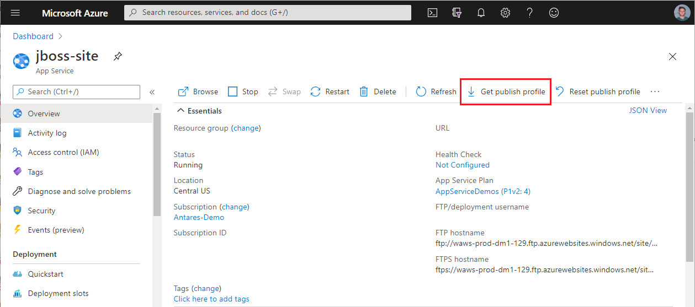
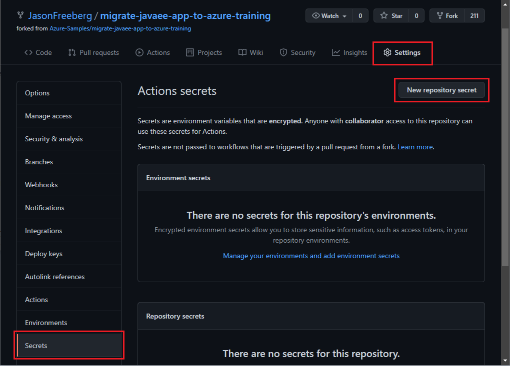

# 05 - Setup GitHub Actions

__This guide is part of the [migrate Java EE app to Azure training](../README.md)__

In this section, learn how to setup a GitHub Actions workflow file and the necessary secrets to continuously deploy your Java EE app.

---

## Overview of GitHub Actions

GitHub Actions is an automation framework with CI/CD built-in and makes it easy to automate your software development workflows. Your automation can be triggered on events like when a commit is pushed, a comment is made, a pull request is opened, or on a schedule. These workflows are stored as `.yml` files in the `.github/workflows` directory of your repository. In this module, you will learn how to define a workflow to build and deploy a Java EE app whenever there is a push on the main branch of the repository.

- [GitHub Actions documentation](https://docs.github.com/actions)

## The workflow file

The workflow shown below builds and deploys the WAR file. Copy and paste this as a new file into the `.github/workflows/` directory. Replace `your-webapp-name` with the name of your Azure webapp, and save the file as `build-and-deploy.yml`.

```yaml
# Docs for the Azure Web Apps Deploy action: https://github.com/Azure/webapps-deploy
# More GitHub Actions for Azure: https://github.com/Azure/actions

name: Build and deploy WAR app to Azure Web App

on:
  push:
    branches:
      - master
  workflow_dispatch:

env:
  WEB_APP: your-webapp-name

jobs:
  build:
    runs-on: ubuntu-latest

    steps:
    - uses: actions/checkout@master

    - name: Set up Java version
      uses: actions/setup-java@v1
      with:
        java-version: '8'

    - name: Build with Maven
      run: mvn -B clean install -Dmaven.test.skip=true 

    - name: Upload artifacts for deployment job
      uses: actions/upload-artifact@v2
      with:
        name: build-artifacts
        path: target/

  deploy:
    needs: build
    runs-on: ubuntu-latest

    - name: Download build artifacts
      uses: actions/download-artifact@v2
      with:
        name: build-artifacts
        path: .

    - name: Deploy to Azure Web App
      uses: azure/webapps-deploy@v2
      with:
        app-name: '${{env.WEB_APP}}'
        slot-name: 'production'
        publish-profile: ${{ secrets.APP_SERVICE_PUBLISH_PROFILE }}
        package: 'build-artifacts/applicationPetstore.war'
```

This workflow file consists of two jobs: a build job and a deployment job. When the build job completes, the contents of the `target/` directory are uploaded to GitHub so the deployment job can download it and deploy the WAR file. The artifacts can be downloaded from the GitHub web UI, making it easy to inspect the deployment artifacts for debugging purposes. Once the deployment job downloads the artifacts, the [`azure/webapps-deploy`](https://github.com/azure/webapps-deploy) action deploys the WAR file to the web app.

This job is triggered whenever there is a push on the master branch, or it can be manually triggered using the GitHub web UI or API. For a full list of GitHub Actions triggers, see [this doc article](https://docs.github.com/actions/reference/events-that-trigger-workflows).

## Add secrets

Next you will need set the site's deployment credentials as a secret on GitHub so that the deployment action can publish the WAR file to the site.

1. Browse to your web app in the Azure Portal and download the publish profile by clicking **Get publish profile**

    

2. Then copy and paste the contents of that file into a GitHub secret named **APP_SERVICE_PUBLISH_PROFILE**

    

## More on GitHub Actions (Optional)

The GitHub Actions workflow featured in this module will build and deploy whenever there is a push on the main branch of the repository. You can create a second workflow to build and test the application whenever a Pull Request is opened on the repository. This will automate the testing process for every proposed contribution, saving time and manual effort. An example workflow for this is shown below. You can save this as a new workflow file in the `.github/workflows/` directory.

```yml
name: Java CI with Maven

on:
  pull_request:
    branches: [ master ]  # You can specify other branches as well, such as "dev" if you have such a banch.

jobs:
  build:

    runs-on: ubuntu-latest

    steps:
    - uses: actions/checkout@v2

    - name: Set up JDK 1.8
      uses: actions/setup-java@v1
      with:
        java-version: 1.8
    
    - name: Build with Maven
      run: mvn -B clean package
```

---

⬅️ Previous guide: [Step 04 - Monitor Java EE Application](../step-04-monitor-java-ee-app/README.md)

➡️ Next guide: [Conclusion](../step-99-conclusion/README.md)